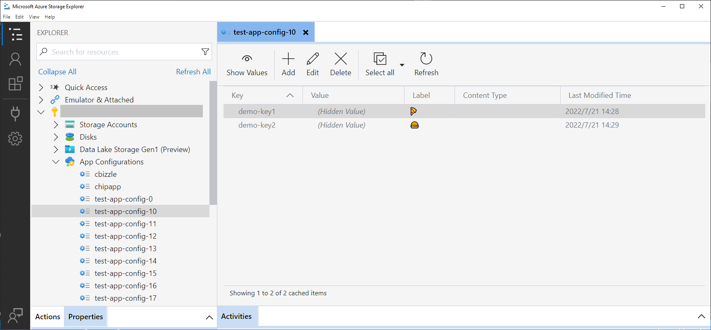

# Getting started

The Azure App Configuration Extension for Microsoft Azure Storage Explorer makes it easy to work with your Azure App Configuration resources in Storage Explorer on Windows, macOS, and Linux.

## Prerequisites

To use this extension, [download](https://azure.microsoft.com/features/storage-explorer/) and install Storage Explorer 1.25.0 or later.

The extension also requires the **App Configuration Data Owner** or **App Configuration Data Reader** role on your user account to grant permissions for accessing the resources. You can configure the role assignments of your Azure App Configuration resources from [Azure Portal](https://portal.azure.com).

## Download and install the extension

- Download the Azure App Configuration extension for Storage Explorer from [here](https://github.com/microsoft/azure-app-configuration-se-extension/releases)
- On Windows or macOS, you can launch the extension bundle (.seix) to install. It will automatically open Storage Explorer with the extension enabled. On Linux, you can use the "File" → "Open Extension" item in the app menu and select the extension bundle to install.
- Once the extension is installed, it will show up in the extensions panel in Storage Explorer.

## Sign-in to Azure account

Use the Connect dialog to sign-in to your Azure account.

## Access Azure App Configuration resources

Once signed-in, you can expand the subscription nodes to access your Azure App Configuration stores. You can also open the data explorer for a store to manage the key-values in it.

The extension provides the basic features to manage your key-values in your stores. If you would like to see additional features, you may open a [feature request](https://github.com/microsoft/azure-app-configuration-se-extension/issues).
